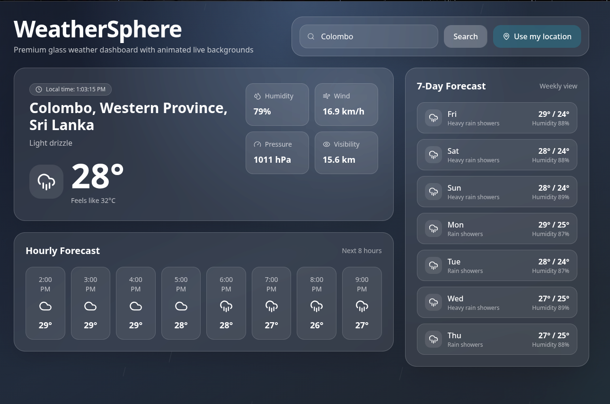

# 🌦️ WeatherSphere

A modern premium weather application built with **React**, **Tailwind CSS**, and **Framer Motion**.
This app provides real-time weather data, hourly forecasts, weekly forecasts, animated weather backgrounds, and location-based weather updates.

---

## ✨ Features

* 🌍 Search weather by city name
* 📍 Get weather using current location
* ⏰ Live local time display
* 🌤️ Real-time weather conditions
* 📅 7-day weather forecast
* 🕒 Hourly forecast
* 🎨 Dynamic animated backgrounds based on weather
* 💎 Glassmorphism UI design
* ⚡ Smooth animations with Framer Motion
* 📱 Responsive design for mobile and desktop

---

# 🛠️ Technologies Used

* ⚛️ React
* 🎨 Tailwind CSS
* 🎞️ Framer Motion
* 🧩 Lucide React Icons
* 🌦️ Open-Meteo API
* 📍 Maps.co Reverse Geocoding API

---

# 📸 Preview

## Clear Weather UI



---

# 📂 Project Structure

```bash
src/
│
├── components/
├── assets/
├── App.jsx
├── main.jsx
└── index.css
```

---

# 🚀 Installation

Clone the repository:

```bash
git clone https://github.com/quintusjonath-jemy/weather_app.git
```

Go to project folder:

```bash
cd weather_app
```

Install dependencies:

```bash
npm install
```

Start development server:

```bash
npm run dev
```

---

# 🌐 APIs Used

## Open-Meteo API

Free weather forecast API used for weather data.

[Open-Meteo API](https://open-meteo.com/?utm_source=chatgpt.com)

## Maps.co API

Used for reverse geocoding user coordinates.

[Maps.co API](https://geocode.maps.co/?utm_source=chatgpt.com)

---

# 📱 Responsive Design

The application is optimized for:

* Desktop
* Tablet
* Mobile devices

---

# 🎯 Future Improvements

* 🌙 Dark / Light mode
* 🗺️ Weather maps integration
* 🔔 Weather alerts
* 🌡️ Air quality index
* 📊 Advanced weather charts
* 🎤 Voice weather assistant

---

# 👨‍💻 Author

Made with ❤️ by Jonath

---

# 📄 License

This project is licensed under the MIT License.
